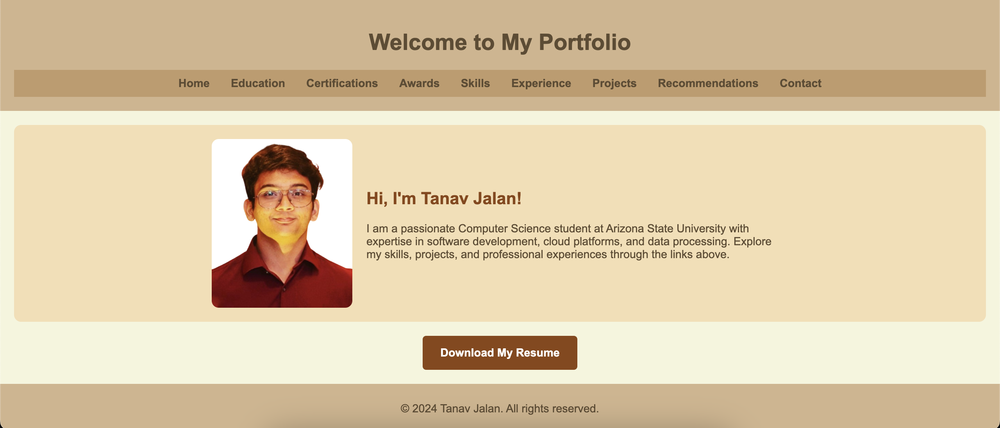

# Portfolio Website for Tanav Jalan

Welcome to the portfolio website of **Tanav Jalan**. This website is designed to showcase skills, education, certifications, work experience, projects, recommendations, and contact information in a professional and visually appealing way.

---

## Table of Contents
1. [Features](#features)
2. [Technologies Used](#technologies-used)
3. [File Structure](#file-structure)
4. [How to Use](#how-to-use)
5. [Customization Guide](#customization-guide)
6. [Deployment Instructions](#deployment-instructions)
7. [Acknowledgments](#acknowledgments)

---

## Features
- **Home Page**: A welcoming introduction to the portfolio.
- **Skills Page**: Showcases technical expertise with interactive slideshows.
- **Education Page**: Lists academic achievements with institution logos and details.
- **Certifications Page**: Highlights certifications with clickable verification links.
- **Work Experience Page**: Describes professional roles with downloadable offer letters and certificates.
- **Recommendations Page**: Displays testimonials with recommender photos and their quotes.
- **Contact Page**: Provides quick links for phone, email, and social media platforms.

---

## Technologies Used
- **HTML**: Structure and content of the website.
- **CSS**: Styling and layout, including responsive design.
- **JavaScript**: Interactive elements such as slideshows.
- **Assets**: Images for logos, certificates, and recommender photos.

---

## File Structure

/project-folder ├── index.html # Home Page ├── skills.html # Skills Page ├── education.html # Education Page ├── certifications.html # Certifications Page ├── work-experience.html # Work Experience Page ├── recommendations.html # Recommendations Page ├── contact.html # Contact Page ├── style.css # CSS file for styling ├── script.js # JavaScript file for interactive elements ├── /images/ # Folder for institution and platform logos ├── /documents/ # Folder for certificates and offer letters

## How to Use
1. **Navigate Pages**:
   - Use the navigation bar at the top of each page to explore different sections.
2. **Interactive Features**:
   - Click the slideshows on the Skills Page to view technologies.
   - Access downloadable certificates from the Work Experience Page.
   - Contact via icons on the Contact Page.
3. **View Recommendations**:
   - Testimonials are listed with photos and detailed quotes.

---

## Customization Guide
### 1. **Update Personal Information**
- Modify content in the respective HTML files.

### 2. **Add/Replace Images**
- Save your new images in the `logos` folder.
- Replace the `src` attributes in `` tags with the new file paths.

### 3. **Add New Pages**
- Create a new `.html` file.
- Link the page in the navigation bar of all existing HTML files by adding a new `<a>` tag.

### 4. **Styling Changes**
- Edit `style.css` to change colors, fonts, or layouts.
- For responsiveness, ensure styles work with media queries (already included).

### 5. **Add or Update Files**
- Add new offer letters, certificates, or other documents in the `documents` folder.
- Update `<a>` tags in relevant pages to link to the new files.

---

## Deployment Instructions
1. **Using GitHub Pages**:
   - Push the project to a GitHub repository.
   - Go to the repository settings, enable GitHub Pages, and select the branch with the HTML files.
   - Your portfolio will be accessible at `https://yourusername.github.io/repository-name`.

2. **Using Netlify**:
   - Drag and drop the entire project folder into Netlify's dashboard for instant deployment.

3. **Using Vercel**:
   - Import the project into Vercel from GitHub or drag and drop it into the Vercel dashboard.

---

## Acknowledgments
- **Icons and Logos**: Some icons and logos are used from publicly available sources for illustrative purposes.
- **Inspiration**: Inspired by the need for a professional online portfolio to showcase achievements effectively.

---

## Contact
For any issues or inquiries, feel free to reach out:
- **Email**: tjalan@asu.edu
- **LinkedIn**: [Tanav Jalan](https://www.linkedin.com/in/tanav-jalan/)
